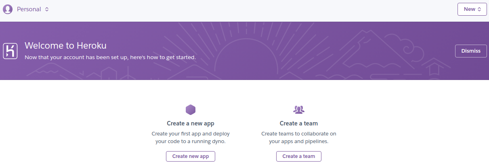
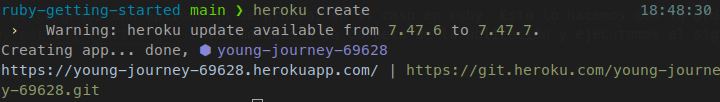
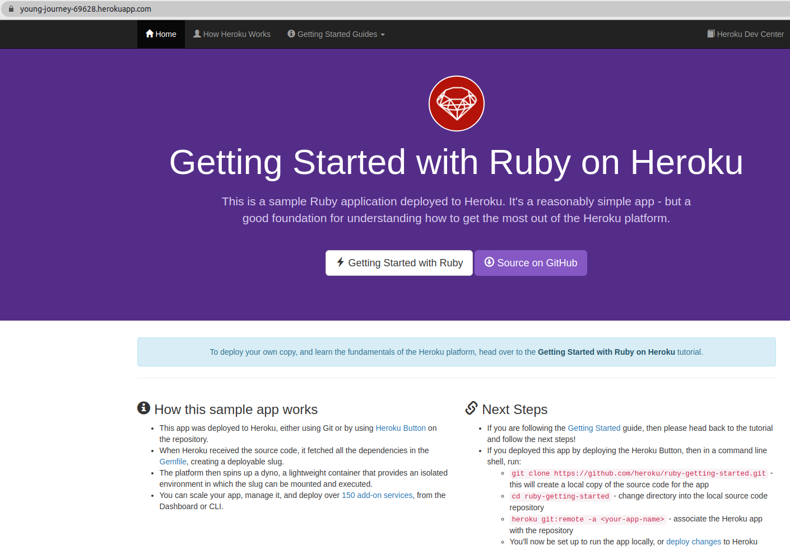
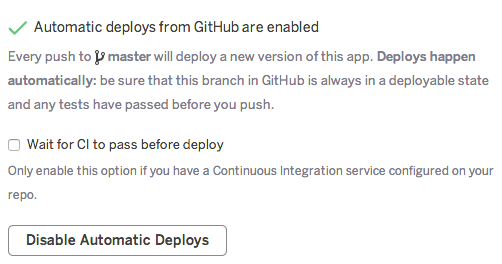

# PaaS

## 1. Darse de alta en algún servicio PaaS tal como Heroku o BlueMix o usar alguno de los PaaS de otros servicios cloud en los que ya se esté dado de alta.

En mi caso, me voy a dar de alta en [Heroku](https://www.heroku.com/). Para ello, pulsamos en Sign Up y ponemos nuestros datos (ruby como lenguaje), dándole posterioremente a CREATE FREE ACCOUNT. Posteriormente, nos vamos a nuestro correo y pulsamos en el enlace que nos mandan, estableciendo en dicho enlace una contraseña para nuestra cuenta. Con todo lo anterior, la cuenta quedaría creada:

## 2. Crear una aplicación en OpenShift o en algún otro PaaS en el que se haya dado uno de alta. Realizar un despliegue de prueba usando alguno de los ejemplos incluidos con el PaaS.

Primero instalamos el cliente de Heroku con la orden `sudo snap install --classic heroku`. Posteriomente, iniciamos sesión en Heroku con `heroku login`.

Ahora, nos descargamos una aplicación de prueba, en mi caso en ruby. Esto lo hacemos con la orden `git clone https://github.com/heroku/ruby-getting-started.git`. Nos movemos a la carpeta de la aplicación y ejecutamos el siguiente comando para crear la aplicación:

`heroku create`

Obteniendo lo siguiente:

Por último, desplegamos la aplicación:

`git push heroku main`

Podemos abrir el sitio web generado con el siguiente comando:

`heroku open`

O bien acceder directamente a la [url](https://young-journey-69628.herokuapp.com/). 

Viendo que la aplicación se ha desplegado correctamente:

## 3. Instalar y echar a andar tu primera aplicación en Heroku.

Ya realizado en el ejercicio anterior.

## 4. Usar como base la aplicación de ejemplo de heroku y combinarla con la aplicación en node que se ha creado anteriormente. Probarla de forma local con foreman. Al final de cada modificación, los tests tendrán que funcionar correctamente; cuando se pasen los tests, se puede volver a desplegar en heroku.

En primer lugar, instalamos foreman:

`gem install foreman`

Para ejecutar localmente la aplicación, hacemos lo siguiente:

`foreman start web`

Para que se pueda desplegar a heroku una vez se han pasado los test, como lo tenemos conectado a nuestro repo de github, simplemente marcamos la casilla que muestro a continuación:

## 5. Haz alguna modificación a tu aplicación en node.js para Heroku, sin olvidar añadir los tests para la nueva funcionalidad, y configura el despliegue automático a Heroku.

Esto se podrá ver en mi [repositorio del proyecto de la asignatura](https://github.com/joseegc10/get-match).