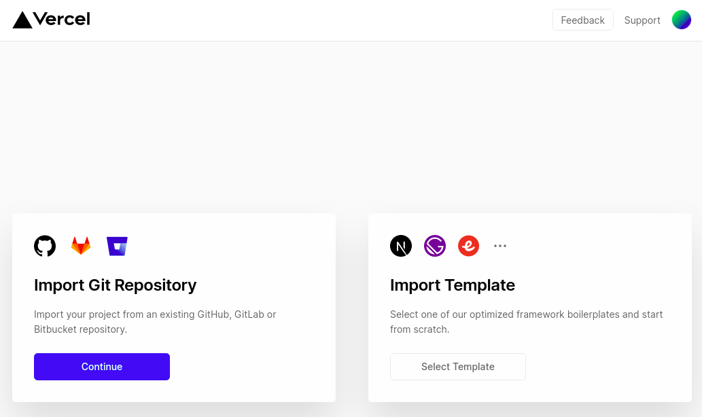
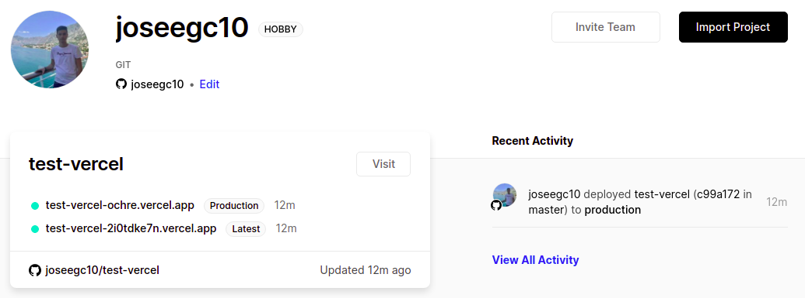

# Serverless

## Ejercicio 1. Darse de alta en Vercel y Firebase, y descargarse los SDKs para poder trabajar con ellos localmente.

### Vercel

Para darnos de alta en Vercel y enlazar un repositorio, seguimos los siguientes pasos:

1. Accedemos a la [página oficial de Vercel](https://vercel.com/).

2. Damos en Sign Up y nos registramos usando GitHub, dandole autorización para acceder a nuestros repos.

3. Pulsamos en añadir un repositorio y añadimos la url del repo.

4. Por último, si queremos obtener el SDK de Vercel, ponemos en nuestra terminal el siguiente comando:

`npm i -g vercel`

### Firebase

Para acceder a Firebase, simplemente accedemos a [la página oficial](https://firebase.google.com/?hl=es-419) y accedemos con nuestra cuenta de go.ugr.es, pues no es necesario crearse otra.

## Ejercicio 2. Tomar alguna de las funciones de prueba de Vercel, y hacer despliegues de prueba con el mismo.

Para ello, el [repositorio](https://github.com/joseegc10/test-vercel) que hemos añadido en el ejercicio anterior debe tener una carpeta api y dentro de esta el archivo con la función, en mi caso date.rb, el cual he obtenido de las funciones de prueba que ofrece Vercel, en el siguiente [enlace](https://vercel.com/docs/serverless-functions/supported-languages#ruby).

Se puede ver [aquí](https://test-vercel-ochre.vercel.app/api/date) el correcto despliegue.